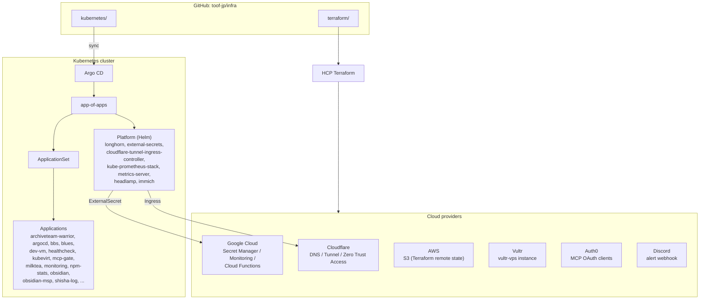
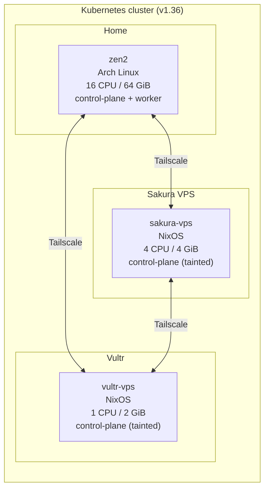

# infra

Personal infrastructure monorepo: Kubernetes manifests synced by Argo CD and Terraform configurations for cloud resources.

## GitOps

- Kubernetes manifests are synced by Argo CD to keep clusters declarative.
- Terraform automation runs via HCP Terraform; it continuously plans/applies the configurations under `terraform/`.

## Repository layout

```
.
├── kubernetes/
│   ├── app-of-apps.yaml      # Argo CD root Application
│   └── applications/         # ApplicationSet + per-app manifests
├── terraform/                # Cloudflare / GCP / AWS / Vultr / Auth0 / Discord resources
└── docs/                     # Operational notes
```

## Architecture



## Kubernetes nodes

All nodes run Kubernetes v1.36 on containerd. Cluster traffic (apiserver, etcd, kubelet) flows over the Tailscale mesh. `zen2` is untainted and runs the workloads; the VPS nodes carry the `control-plane` taint.


